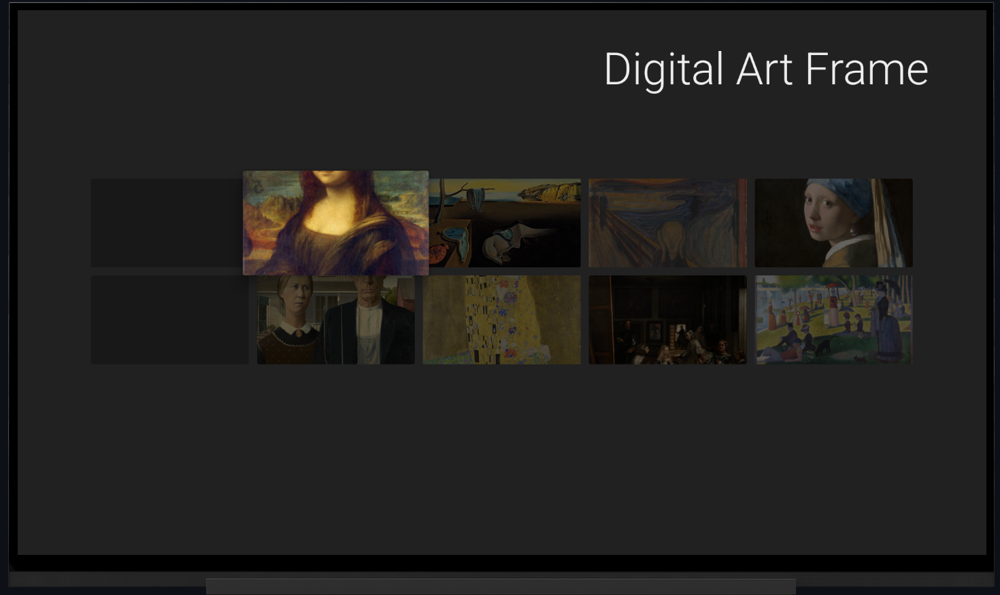
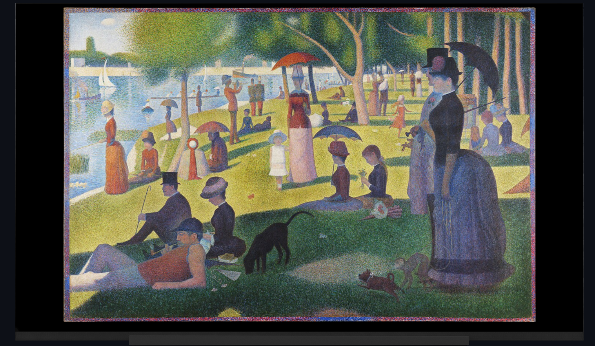

# StreamVerse - Marco de Arte Digital para TV

  
  

## 📄 Sobre el Proyecto

**StreamVerse** es una aplicación conceptual para Android TV que transforma tu televisor en un elegante marco de arte digital. La aplicación funciona como una galería virtual, mostrando una colección curada de obras de arte famosas en una interfaz sencilla y optimizada para la navegación con control remoto, todo ambientado con música de fondo.

Este proyecto sirve como una demostración práctica de los principios de desarrollo de aplicaciones para TV utilizando el framework **Leanback** de Android.

---

## ✨ Características

*   **Interfaz Nativa para TV**: Construida con componentes del framework Leanback para una experiencia de usuario fluida y nativa.
*   **Galería de Arte en Cuadrícula**: Presenta las obras de arte en una cuadrícula vertical, mostrando una vista previa, el título y el autor.
*   **Vista de Detalles Inmersiva**: Permite al usuario ver cada obra a pantalla completa para apreciar todos sus detalles.
*   **Navegación Intuitiva**: Totalmente operable con un control remoto (D-pad), siguiendo las convenciones de Android TV.
*   **Música de Ambiente**: Un servicio de música en segundo plano (`MusicService`) reproduce una melodía en bucle para crear una experiencia más relajante.

---

## 🛠️ Componentes y Tecnologías

La aplicación está construida en **Kotlin** y se apoya en los siguientes componentes clave del ecosistema de Android:

| Componente | Propósito |
| :--- | :--- |
| **Kotlin** | Lenguaje de programación principal. |
| **Android TV (Leanback)** | Framework nativo para construir interfaces de usuario para TV. |
| `VerticalGridSupportFragment` | Para mostrar el catálogo principal de arte en una cuadrícula. |
| `ImageCardView` & `Presenter` | Para definir la apariencia y el comportamiento de cada tarjeta de la cuadrícula. |
| `MediaPlayer` & `Service` | Para gestionar la reproducción de música de fondo de forma independiente. |
| **Glide** | Para cargar eficientemente las imágenes de las obras de arte desde una URL. |

---

## 🚀 Cómo Empezar

Sigue estos pasos para ejecutar el proyecto en tu propio entorno de desarrollo.

### Prerrequisitos

*   **Android Studio**: Asegúrate de tener una versión reciente.
*   **Emulador de Android TV**: O un dispositivo físico con Android TV.

### Instalación y Ejecución

1.  **Abre el Proyecto**: Inicia Android Studio y abre la carpeta del proyecto.
2.  **Configura un Emulador de TV** (si no tienes uno):
    *   En Android Studio, ve a `Tools` > `AVD Manager`.
    *   Haz clic en `Create Virtual Device...` y selecciona la categoría `TV`. Elige un perfil de hardware (ej. 1080p).
    *   Selecciona una imagen del sistema para TV (ej. Android 12L).
3.  **Ejecuta la Aplicación**:
    *   Selecciona tu emulador de TV en la barra de dispositivos.
    *   Haz clic en el botón **Run 'app'** (▶️). Android Studio compilará el código, instalará el APK en el emulador y lanzará la aplicación automáticamente.
